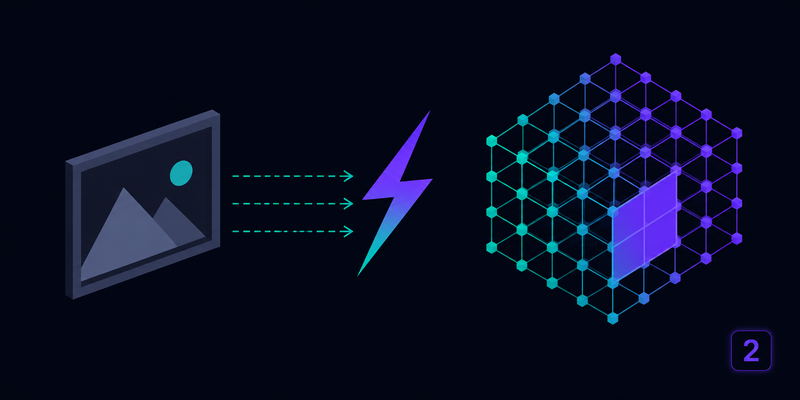

<p align="center"></p>

# ComfyUI-TRELLIS2-HiCache

<p>
  <a href="https://github.com/Archerkattri/ComfyUI-TRELLIS2-HiCache/releases"></a>
  <a href="https://registry.comfy.org/publishers/archerkattri/nodes/comfyui-trellis2-hicache"></a>
  <a href="LICENSE"></a>
</p>


Training-free acceleration for **TRELLIS.2** image-to-3D in ComfyUI. It forecasts
the flow-matching velocity on skipped DiT steps instead of running the
transformer, across TRELLIS.2's sparse-structure and shape-SLaT stages (texture
stage optional), via the [`hicache-pp`](https://pypi.org/project/hicache-pp/)
library.

Pairs with [visualbruno/ComfyUI-Trellis2](https://github.com/visualbruno/ComfyUI-Trellis2)
(the `TRELLIS2PIPELINE` type). The TRELLIS v1 sibling is
[ComfyUI-TRELLIS-HiCache](https://github.com/Archerkattri/ComfyUI-TRELLIS-HiCache).

## What it does

TRELLIS.2 samples each stage with a flow-Euler loop that calls a DiT once (or
twice, under classifier-free guidance) per step. **TRELLIS.2 HiCache Accelerate**
replaces the flow DiTs with a wrapper that runs the transformer on a schedule and
*forecasts* the velocity on the steps in between:

* **`hermite`** -- HiCache (dual-scaled physicist's Hermite polynomial, arXiv:2508.16984).
* **`dmd`** -- HiCache++ (Dynamic Mode Decomposition / Prony exponential basis).
* **`auto`** -- holdout-selected per step.

TRELLIS.2 has five flow DiTs (`sparse_structure`, `shape_slat` at 512/1024,
`tex_slat` at 512/1024); `stages` selects which to accelerate (`both` = shape
generation, the default; `all` adds texture). Two TRELLIS-specific details are
handled correctly: the timestep schedule runs `1 -> 0` (run boundaries are
detected by direction reversal, not a fixed threshold), and classifier-free
guidance issues the conditional and unconditional forwards *separately* inside a
guidance interval, so the patch keeps two parallel forecast states. The SLaT
stages return sparse tensors whose active-voxel layout is fixed during a run, so
the forecast runs on `.feats` and the sparse tensor is rebuilt from the last
computed step.

## Measured (RTX 5090, TRELLIS.2-4B, `512` pipeline, interval=2, shape stages)

| metric | value |
|---|---|
| speedup | **1.9x** |
| Chamfer vs stock (mesh verts) | 0.0107 (near-lossless) |
| SS / shape-SLaT skips | 9 / 9 of ~22 DiT calls each |

`interval=2` is the default. Chamfer is the symmetric mean nearest-neighbour
distance between the stock and accelerated mesh vertices; higher intervals trade
fidelity for more speed.

## Install

```bash
cd ComfyUI/custom_nodes
git clone https://github.com/Archerkattri/ComfyUI-TRELLIS2-HiCache
pip install hicache-pp
```

## Use

`(TRELLIS2 loader)  ->  TRELLIS.2 HiCache Accelerate  ->  (TRELLIS2 sampler)`

Set `enabled = Off` to bypass and restore the stock DiTs. The node never mutates
the pipeline it is given (copy-on-patch).

## Validation

`tests/test_patch.py` unit-tests the patch logic with a dummy DiT (no ComfyUI, no
GPU). `tests/validate_gpu.py` is the end-to-end GPU check that produced the table
above on a real TRELLIS.2-4B pipeline.

Apache-2.0.
